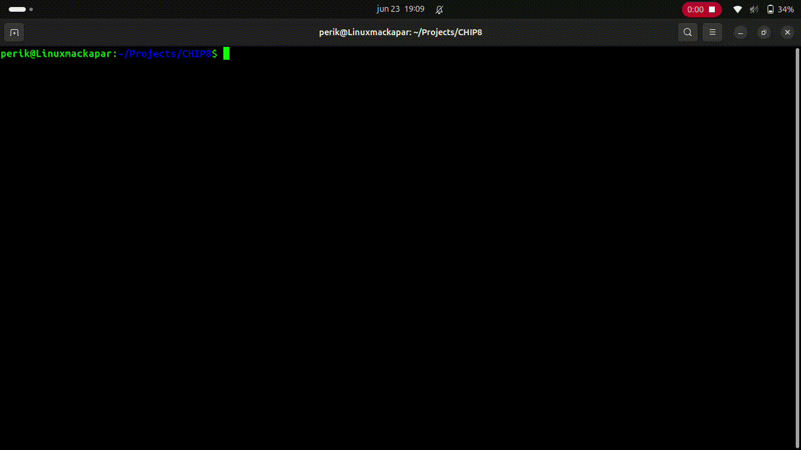

# CHIP8
`A CHIP8 emulator in C based on the tutorial https://austinmorlan.com/posts/chip8_emulator/ 

# PROMO 

# TODO
Fixa cmake
Fixa ett gui där man kan välja spel/program

# Kompilering
just nu med gcc -g main.c chip8.c -o chip8 $(sdl2-config --cflags --libs). 
